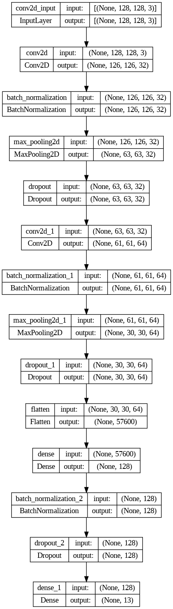

# Sub-Category Prediction with Deep Learning (CNN)

## Objective

The objective of this project is to build a deep learning model for sub-category prediction. This will help our colleagues identify sub-categories more rapidly and accurately based on the training data across similar platforms.

## Technology Stack

1. UI: Streamlit

2. API: FastAPI

3. Cloud Server: Digital Ocean

4. CI/CD: Docker, GitHub Actions

## Implementation Details

Streamlit: Used for the user interface to interact with the deep learning model.

FastAPI: Used to create an API for the deep learning model, enabling easy integration with other systems.

Docker: Utilized for containerization, ensuring consistent deployment across different environments.

Digital Ocean: Chosen as the cloud server provider for hosting the application and model.

## Development Process

To run the project, follow these steps:
1. Ensure Poetry is installed.
2. Clone the repository.
3. Run poetry install to install dependencies.
4. Run poetry run streamlit run app.py to start the Streamlit app.
5. Use the app to interact with the deep learning model.

## Model Training

### Data Preprocessing

1. Image Data Generators: Used to augment the training images to improve model generalization.

2. Train-Test Split: Data split into training and testing sets for model evaluation.

### Model Architecture

1. Convolutional Neural Network (CNN): Used for image classification.

2. Layers: Includes convolutional layers, batch normalization, max pooling, dropout, and dense layers.

    - Input Layer: The input shape is (128, 128, 3), indicating images with a height and width of 128 pixels and 3 color channels (RGB).

    - Convolutional Layers: The first convolutional layer has 32 filters of size (3, 3) and uses the ReLU activation function.
    Batch normalization is applied after the first convolutional layer.
    
    - Max pooling with a pool size of (2, 2) is used to downsample the spatial dimensions.
    
    - Dropout: Dropout with a rate of 0.25 is applied after the first max pooling layer to prevent overfitting.
    
    - Second Convolutional Layer: Similar to the first convolutional layer, but with 64 filters.

    - Flatten Layer: Flattens the output from the convolutional layers into a 1D array to prepare for the fully connected layers.
    
    - Dense Layers: The first dense layer has 128 units and uses the ReLU activation function.

    - Batch normalization is applied after the first dense layer.

    - Dropout with a rate of 0.5 is applied after the batch normalization layer to prevent overfitting.

    - Output Layer: The output layer has units equal to the number of classes in your dataset (num_classes). It uses the softmax activation function to output a probability distribution over the classes.

### Model Compilation

1. Optimizer: Adam optimizer with a learning rate of 0.001.

2. Loss Function: Categorical cross-entropy.

3. Metrics: Accuracy metric used for model evaluation.

### Callbacks

1. Learning Rate Scheduler: Adjusts learning rate during training.

2. TensorBoard: Logs model training metrics for visualization.

3. Early Stopping: Stops training early if validation loss does not improve.

### Training
1. Class Weights: Calculated to handle class imbalance in the dataset.

2. Epochs: Trained for a specified number of epochs with early stopping.

3. Callbacks: Used to monitor and improve training.

### Performance Evaluation

1. Model Summary: Displays the model architecture and parameters.

2. Validation: Model performance evaluated on the test set.

3. TensorBoard: Visualizes training metrics for analysis.

### Conclusion
**This project demonstrates how to build a deep learning model for sub-category prediction using Streamlit, FastAPI, Docker, and Digital Ocean. By following the provided steps, you can deploy the model and interact with it through the user interface or API.**

made by : [Bob Sebastian](https://www.linkedin.com/in/bobsebastian24/)